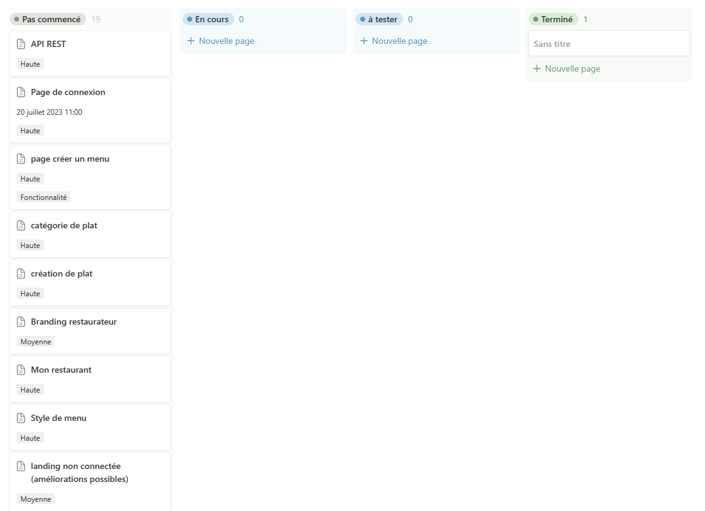

---
presentation:
  width: 1280
  height: 1024
  theme: beige.css
---

<!-- slide -->

# Outils de gestion de projet avec notion

## MenuMaker by Qwenta

https://www.notion.so/43737415060b4bb2bb151183ee947ebf?v=8d91624d79084295af9343c8adfc310d

<!-- slide -->

## Pourquoi découper le projet en plusieurs tâches?

- Un projet se réalise en plusieurs semaines voire plusieurs mois
- Réaliser une tâche et voir le bout de celle-ci entretien le moral de l'équipe
- Les tâches peuvent être améliorées au fil du temps

<!-- slide -->

## kanban

<!-- slide -->

## kanban et tâches détaillées

<!-- slide -->

## Kanban qu'es-ce que c'est?

Kanban est une méthode gestion de projet visuelle sous la forme d'un tableau ou d'un emploi du temps.
Les tâches sont triées et glissable dans les colonnes par leur statut, ce qui permet de voir ce qui vont être fait et ce qui a été fait.
