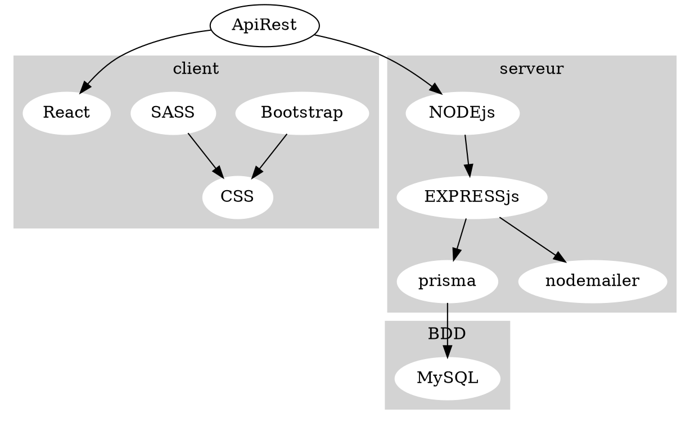

---
presentation:
  width: 1280
  height: 1024
  theme: beige.css
---

<!-- slide -->

# Spécifications techniques

## MenuMaker by Qwenta

<!-- slide -->

## Diagramme

<!-- slide -->

## spécifications techniques

- front-end:

  - React
  - bootstrap et SASS
  - javascript natif

- API:

  - API REST
    => documentation avec Swagger
  - Instagram API
  - node-deliveroo

- back-end:
  - node.js
  - express.js
  - Prisma
  - nodemailer
  - BDD:
    - mySQL

<!-- slide -->

## React

React utilise une approche basée sur les composants qui peuvent être mis à jour indépendamment, ce qui rend le développement et la maintenance des applications plus faciles.

- React-modal => efficace et optimale
- React-loader-spinner => customisation et efficacité
- react-image => importation logo
- React-font => efficace et adéquate
- react-drag-drop-files => simplicité
- React-navbar => malléable
- React-pdf => efficace et optimale
- react-to-print => performante
- react-virtual-dom => optimisation, fluidité et réactivité
- react router => gestion des routes optimale
- react-hook-form => minimise le code et pratique

<!-- slide -->

## Bootstrap et SASS

- Faciliter le CSS et mixins, écrire des morceaux de codes réutilisables
- Lecture et rédaction plus efficace
- bloc de code qui permet de personnaliser plus facilement des styles préexistants et de créer des styles spécifiques.
- Les cards => présentation des étapes
- Icons
- Boutons
- Mise en page

<!-- slide -->

## CSS

- styliser les éléments du site web que je n'ai pas pu faire en Bootstrap ou React
- Palette de couleurs

<!-- slide -->

## API

- API REST:

  - simple à développer
  - gestion facile de la base de données
  - évolutive, adaptable à la croissance du projet => gérer plus de requêtes
  - manipulation de données simplifiée.
  - Utilisable par n'importe quel langage
  - maintenance et mise à jour simple
  - Sécurisées

  => gérée par le Framework Express de Node.js et l'ORM prisma

- node-deliveroo
- instagram api => connexion avec app externe

<!-- slide -->

## Documentation Swagger - OpenApi

Construire et documenter des API REST de manière simple et efficace et facilite la collaboration entre développeurs

<!-- slide -->

## node.js

- token JWT => efficace et optimale
  - temps de validité limité
  - stockage dans un cookie sécurisé

<!-- slide -->

## express.js

Le framework Express de Node.js:

- fonctionnalités pour le routage
- la gestion des requêtes, des réponses et des sessions
- flexible et modulaire

<!-- slide -->

## ORM prisma (Object-Relational Mapping)

- un outil qui facilite l'accès à la base de données dans les applications Node.js
- Il permet de gérer efficacement les opérations CRUD (Create, Read, Update, Delete) en utilisant une API plutôt que d'écrire des requêtes SQL.

<!-- slide -->

## nodemailer

- Module nodemailer de express.js
  - Le module permet d'envoyer plus facilement tous types d'e-mails (notification, transactionnels, newsletter)
  - pas besoin de se connecter avec un mdp

<!-- slide -->

## MySQL

MySQL est un système de gestion de base de données qui permet de :

- stocker
- organiser
- gérer efficacement les données

<!-- slide -->

## Hébergement web

- Hébergement web Hostinger permet:

  - Transférer les fichiers de votre site web
  - configurer la base de donnée
  - choisir un nom de domaine
  - Effectuer régulièrement des sauvegardes en installant des mise à jour de sécurité et surveiller les performances
