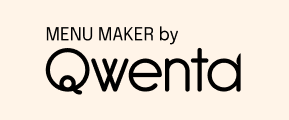
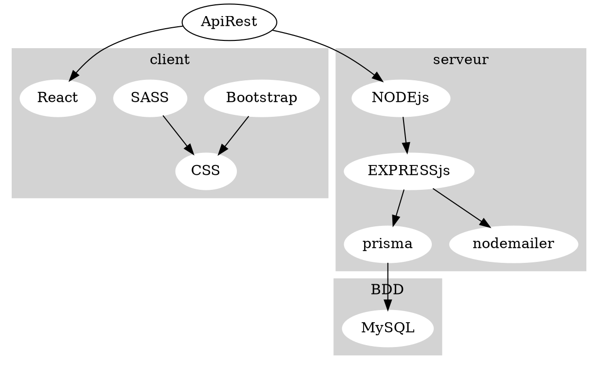
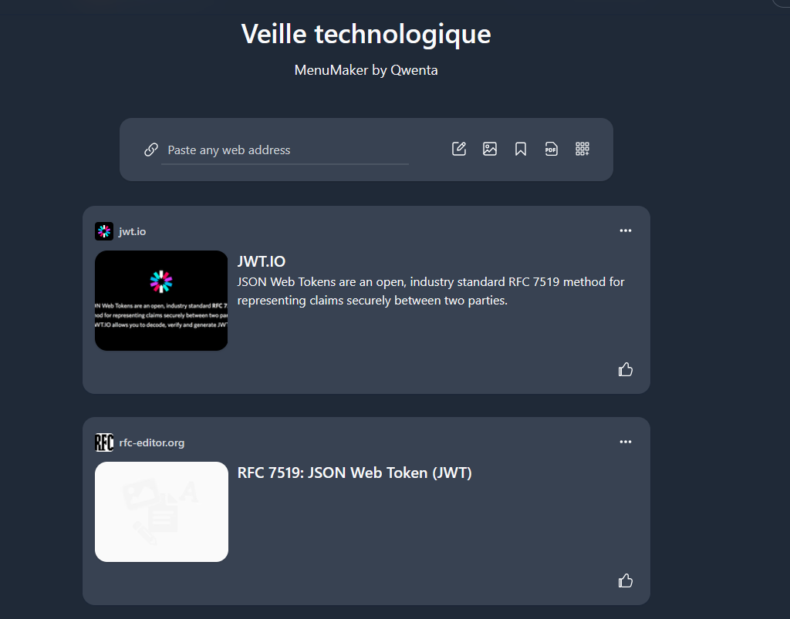

---
presentation:
  width: 1280
  height: 1024
  theme: beige.css
---

<!-- slide -->

# Veille technologique

https://wakelet.com/wake/9NQQuzBKyfkOzKu_AZnJk

<!-- slide -->

<!-- slide -->

<!-- slide -->

## Comment je fais ma veille technologique?

Aujourd'hui tous les informations qui m’ont permis de construire ma veille technologique sont accessible via internet, l’accès est open source et des mise à jour sont faits régulièrement.
On peut trouver nos informations :

- les réseaux sociaux : Twitter, facebook
- les blogs de développeurs => Codeur.com
- Youtube => vidéo en lien avec les langages de programmations, explications
- agrégateur de contenu en ligne feedly => permet une lecture personnalisée avec différentes ressources (articles, blogs, publication de différents site web).

<!-- slide -->

## Comment j'ai sélectionné ma ressource?

- Usage des langages informatique maîtrisées par l'équipe
- Compatibilité des langues utilisées
- optimisation et efficacité

  - Youtube -> explication vidéo max 5 min
  - Site web officiel de chaque langage
  - Blog de développeur
  - réseaux sociaux

<!-- slide -->

## Comment j'ai classé mes informations

Langages de programmation selon leur catégorie:

- Front-end
- Back-end
- API REST

<!-- slide -->

## comment les informations peuvent être commentées et diffusées

Utilisation de l'outil de veille Wakelet:

- Pratique pour la collect d'information
- faire une collection selon un thème
- se tenir au courant des dernières actualités, des tendances qui peuvent être liées au projet

<!-- slide -->

## les informations issues de la veille que tu vas utiliser pour définir les spécifications techniques

- front-end:
  - bootstrap
  - React
  - SASS
- back-end:
  - node.js
  - express.js
  - Prisma
  - nodemailer
  - BDD:
    - MySQL
- API:
  - API REST + documentation avec Swagger
  - Instagram API
  - node-deliveroo

<!-- slide -->

## Back-end

MySQL est une base de donnée très utilisé par les développeurs et les entreprises car c’est une base de donnée performante, évolutive, fiable et économique.

=> express.js et l’ORM prisma pour une gestion facile de la BDD et une manipulations simplifiées des données.
-Info utilisateurs, inscription, e-mail
-Info restaurant et le logo

<!-- slide -->

## API REST

Les clients communiquent avec le serveur en envoyant des requêtes HTTp pour accéder, modifier ou supprimer des ressources spécifiques.

=> Swagger pour documenter, construire et concevoir une API REST, elle facilite aussi la collaboration grâce à son visuel et permet à son utilisateurs de tester l’API.
